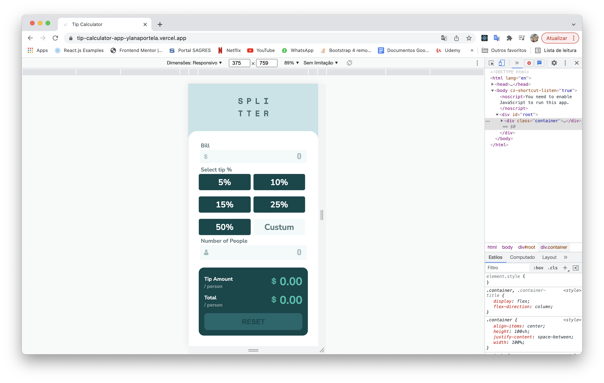
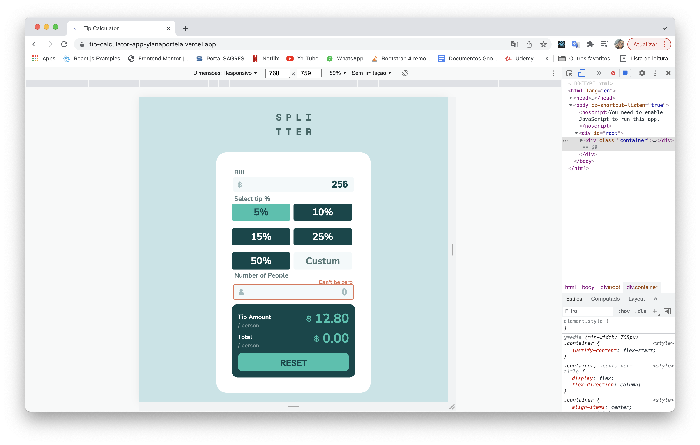
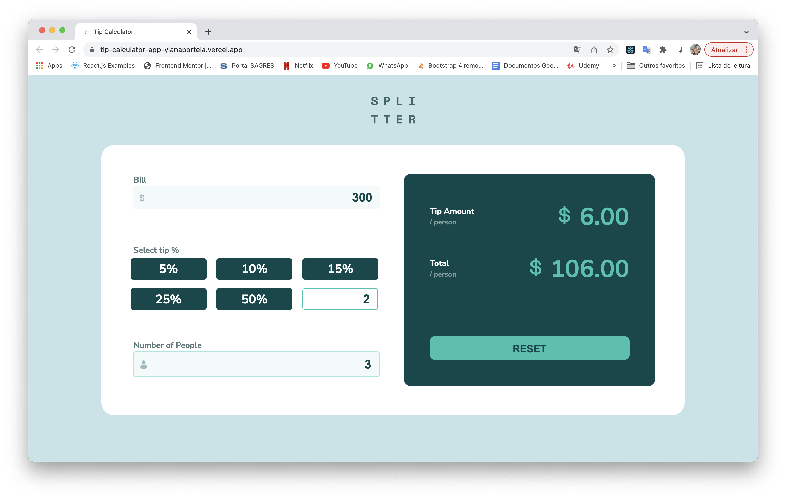

# Frontend Mentor - Tip calculator app solution

This is a solution to the [Tip calculator app challenge on Frontend Mentor](https://www.frontendmentor.io/challenges/tip-calculator-app-ugJNGbJUX). Frontend Mentor challenges help you improve your coding skills by building realistic projects.

## Table of contents

- [Overview](#overview)
  - [The challenge](#the-challenge)
  - [Screenshot](#screenshot)
  - [Links](#links)
- [My process](#my-process)
  - [Built with](#built-with)
  - [What I learned](#what-i-learned)
  - [Continued development](#continued-development)
  - [Useful resources](#useful-resources)
- [Author](#author)


## Overview

### The challenge


- View the optimal layout for the app depending on their device's screen size
- See hover states for all interactive elements on the page
- Calculate the correct tip and total cost of the bill per person

### Screenshot





### Links

- Solution URL: [https://www.frontendmentor.io/solutions/tip-calculater-app-JDbNPzprk]
- Live Site URL: [https://tip-calculator-app-ylanaportela.vercel.app/]
## My process

### Built with

- Flexbox
- CSS Grid
- Mobile-first workflow
- [React](https://reactjs.org/) - JS library
- [Next.js](https://nextjs.org/) - React framework
- [Styled Components](https://styled-components.com/) - For styles


### What I learned


```html
<h1>Some code I'm proud of</h1>
```
```css
.proud-of-this-css {
   .output-values__tip, .output-values__total{
        .value{
            align-self: start;
            font-size: 48px;
        }
        .value-icon{
            height: 60%;
            min-width: 5%;
            align-self: baseline;
        }

        .text-title{
            font-size: 16px;
        }
    }
}
```
```js
const proudOfThisFunc = () => {
  
   const tips = [5, 10, 15, 25, 50, buttonCustom]

  function handleClick(tip) {

    if (tip === buttonCustom) { 
      setButtonCustom(
      <input className='input-costum' type='number' onChange={e => setButtonActive(Number(e.target.value))}/>
      )
    }
   
    setButtonActive(tip)
  }
```


### Continued development

I intend to learn more about Sass and continue practicing the React features. 📚

### Useful resources


- [A Simple Explanation of React.useEffect()](https://dmitripavlutin.com/react-useeffect-explanation/) - This is an amazing article which helped me finally understand the hook useEfffect. I'd recommend it to anyone still learning this concept.


## Author

- Linkedin - [Ylana Portela](https://www.linkedin.com/in/ylana-portela/)
- Frontend Mentor - [@ylanaportela](https://www.frontendmentor.io/profile/ylanaportela)


